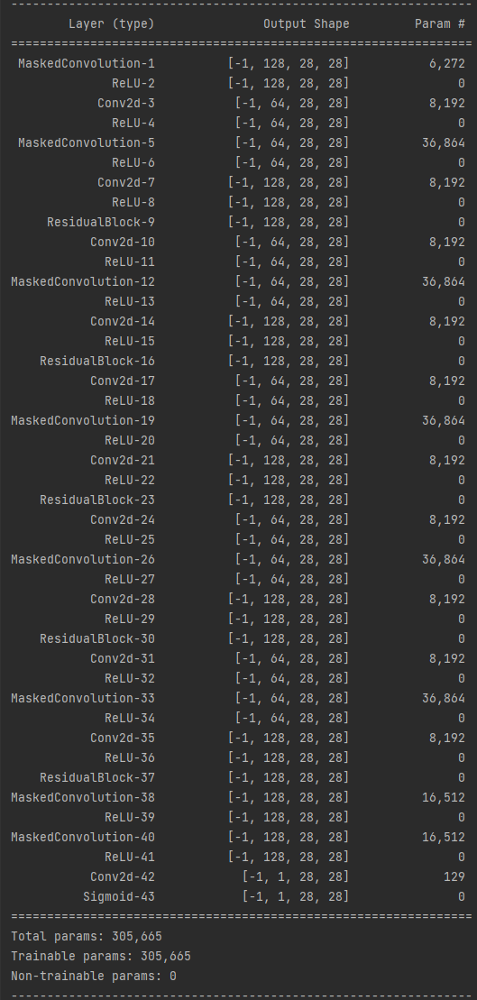
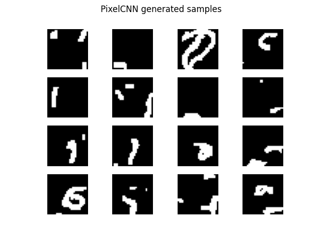
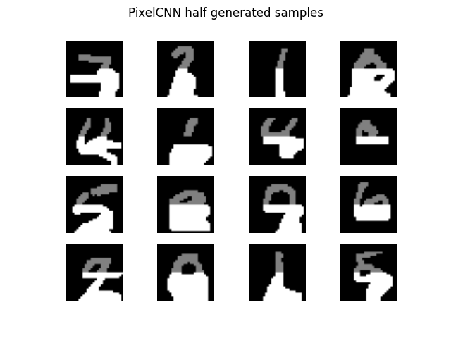

# Autoregressive model(PixelCNN)
PixelCNN implementation

## Model architecture
* Feature map channel = 128
* The number of residual block = 5



## Optimize
$D_{KL}(P_{data}||P_{\theta}) = E_{X \sim P_{data}}[\log \frac{P_{data}(X)}{P_{\theta}(X)}] = E_{X \sim P_{data}}[\log P_{data}(X)] - E_{X \sim P_{data}}[\log P_{\theta}(X)]$   
$\to E_{X \sim P_{data}}[\log P_{data}(X)]$ = Constance (because, not depend on $P_{\theta}$)   
$\therefore$ Maximize $E_{x \sim P_{data}}[\log P_{\theta}(X)]

$BCELoss(P_{\theta}(X), P_{data}(X)) = -(P_{data}(X)\cdot\log P_{\theta}(X) + (1 - P_{data}(X)\ logP_{\theta}(X))$
= $-\sum_XP_{data}(X)\log P_{theta}(X) = -E_{X \sim P_{data}}[\log P_{\theta}(X)]$   
$\therefore$ Minimize $BCELoss(P_{\theta}(X), P_{data}(X))$ = Maximize $E_{x \sim P_{data}}[\log P_{\theta}(X)]$
```python
bce_loss = nn.BCELoss()

...

out = model(x)
loss = bce_loss(out, x)
```
## Train
Run train.py


## Generate
Run sampling.py




