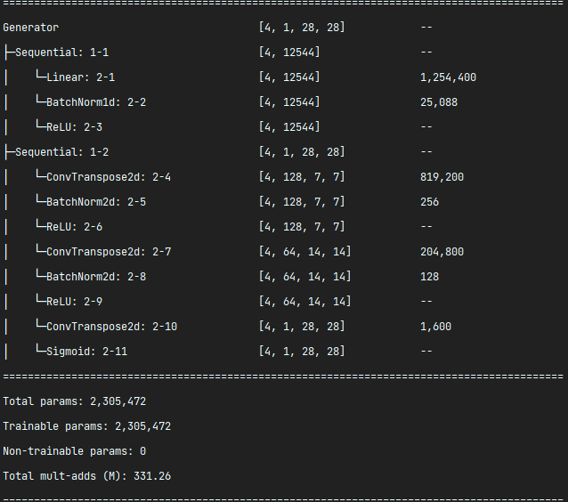
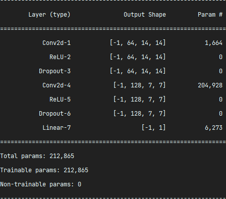
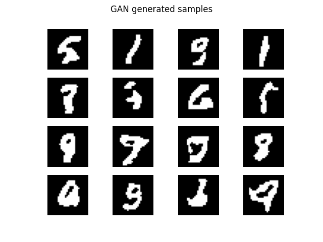

# GAN model(DCGAN)
GAN implementation

## Model Architecture
* Generator   
Noise Dimension = 100   


* Discriminator



## Optimize
$D_{\phi}$ = Discriminator, $G_{\theta}$ = Generator
$\underset{\theta}{\min}\ \underset{\phi}{\max}\ E_{X \sim P_{data}}[\log D_{\phi}(X)] + E_{z \sim P(z)}[\log (1 - D_{\phi}(G_{\theta}(z))]$   
* $\underset{\phi}{\max}\ E_{X \sim P_{data}}[\log D_{\phi}(X)] + E_{z \sim P(z)}[\log (1 - D_{\phi}(G_{\theta}(z))]$   
```python
real_loss = F.binary_cross_entropy_with_logits(real_output, torch.ones_like(real_output))
fake_loss = F.binary_cross_entropy_with_logits(fake_output, torch.zeros_like(fake_output))
total_loss = real_loss + fake_loss
```
* $\underset{\theta}{\min}\ E_{z \sim P(z)}[\log (1 - D_{\phi}(G_{\theta}(z))]$   
```python
total_loss = F.binary_cross_entropy_with_logits(fake_output, torch.ones_like(fake_output))
```

## Train
Run train.py


## Generate
Run sampling.py

