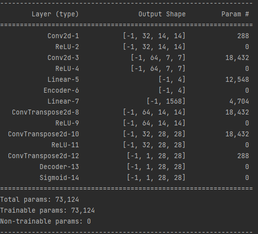

# Latent Variable model(Variational Autoencoder)
Variational Autoencoder implementation

## Model Architecture
* Latent dim = 2
* encoder layers = 2
* decoder layers = 2

## Optimize
$P_{\theta}(X) = \sum_zP_\theta (X,z) = \sum_z\frac{q(z)}{q(z)}P_\theta(X,z)=E_{z \sim q(z)}[\frac{P_\theta(X,z)}{q(z)}]$   
$\log(E_{z \sim q(z)}[\frac{P_\theta(X,z)}{q(z)}]) \ge E_{z \sim q(z)}[\log(\frac{P_\theta(X,z)}{q(z)})]$ (Jenson Inequality)   
$ELBO = E_{z \sim q(z)}[\log(\frac{P_\theta(X,z)}{q(z)})]$   
$ELOB = \sum_zq(z)\log(\frac{P_\theta(X,z)}{q(z)}) = \sum_zq(z)\log P_\theta(X,z) - \sum_zq(z)\log q(z)$   
$= \sum_zq(z)log P_\theta(X,z) + H(q)$   
$if\ q == P(z|X; \theta)$   
$\to \log P(X;\theta) = \sum_zq(z)\log P(z, X;\theta) + H(q)$   